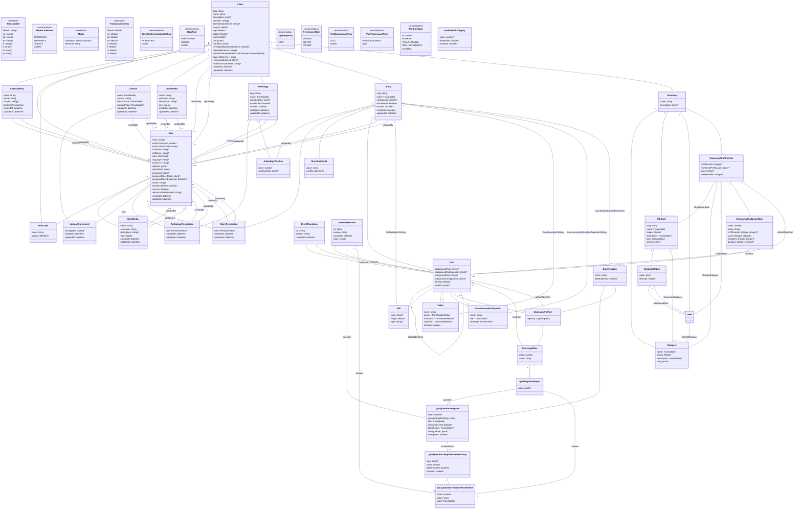

# STORIES

## Class diagram

```mermaid
classDiagram
  class Translatable {
      <<interface>>
      default: string?
      en: string?
      de: string?
      es: string?
      fr: string?
      it: string?
      nl: string?
      pt: string?
  }

  class MediaCollection {
      <<enumeration>>
      EXTERNALS
      INTERNALS
      CLIENTS
      USERS
  }

  class Media {
      <<interface>>
      collection: MediaCollection
      filename: string
  }

  class TranslatableMedia {
      <<interface>>
      default: Media?
      en: Media?
      de: Media?
      es: Media?
      fr: Media?
      it: Media?
      nl: Media?
      pt: Media?
  }

  %% CLIENT-USER MODULE

  class ClientAuthenticationMethod {
      <<enumeration>>
      PASSWORD
      CODE
  }

  class UserRole {
      <<enumeration>>
      PARTICIPANT
      EDITOR
      ADMIN
  }

  class Client {
      slug: string*
      name: string
      description: jsonb?
      domains: string[]
      administrationEmail: string?
      favicon: Media?
      logo: Media?
      splash: Media?
      hero: Media?
      css: jsonb?
      manifest: jsonb?
      isFindableBySearchEngines: boolean
      plausibleDomain: string?
      authenticationMethods: ClientAuthenticationMethod[]
      accessTokenKey: string
      redirectAuthorized: string?
      redirectUnauthorized: string?
      createdAt: datetime
      updatedAt: datetime
  }

  class ClientApiKey {
      name: string
      secret: string
      scopes: string[]
      lastUsedAt: datetime
      createdAt: datetime
      updatedAt: datetime
  }

  class User {
      email: string?
      emailConfirmed: boolean
      emailConfirmCode: string?
      firstName: string?
      lastName: string?
      roles: UserRole[]
      language: string?
      pronouns: string?
      address: jsonb?
      dateOfBirth: date?
      password: string?
      passwordResetCode: string?
      passwordResetExpiresAt: datetime?
      phone: string?
      phoneConfirmed: boolean
      isActive: boolean
      reasonForDeactivation: string?
      createdAt: datetime
      updatedAt: datetime
  }

  class AuthCode {
      value: string
      usedAt: datetime?
  }

  class License {
      name: Translatable
      version: string
      termsOfUse: Translatable?
      privacyPolicy: Translatable?
      createdAt: datetime
      updatedAt: datetime
  }

  class LicenseAgreement {
      isAccepted: boolean
      createdAt: datetime
      updatedAt: datetime
  }

  class ClientMedia {
      name: string
      extension: string
      description: string?
      size: integer
      createdAt: datetime
      updatedAt: datetime
  }

  class UserMedia {
      name: string
      extension: string
      description: string?
      size: integer
      createdAt: datetime
      updatedAt: datetime
  }

  Client "1" -- "*" ClientApiKey
  Client "1" -- "*" User
  Client "1" -- "*" AuthCode
  User "1" -- "*" AuthCode
  Client "1" -- "*" License
  Client "1" -- "*" ClientMedia
  User "1" -- "*" UserMedia
  User "1" -- "*" LicenseAgreement
  License "1" -- "*" LicenseAgreement

  Client "*" -- "0..1" User: createdBy
  Client "*" -- "0..1" User: updatedBy
  ClientApiKey "*" -- "0..1" User: createdBy
  ClientApiKey "*" -- "0..1" User: updatedBy
  License "*" -- "0..1" User: createdBy
  License "*" -- "0..1" User: updatedBy
  ClientMedia "*" -- "0..1" User: createdBy
  ClientMedia "*" -- "0..1" User: updatedBy
  UserMedia "*" -- "0..1" User: createdBy
  UserMedia "*" -- "0..1" User: updatedBy

  %% STORY MODULE

  class LogicHitpolicy {
      <<enumeration>>
      FIRST
  }

  class PermissionRole {
      <<enumeration>>
      VIEWER
      EDITOR
      OWNER
  }

  class PartBackgroundType {
      <<enumeration>>
      STILL
      VIDEO
  }

  class PartForegroundType {
      <<enumeration>>
      ANNOUNCEMENT
      QUIZ
  }

  class Anthology {
      slug: string
      name: Translatable
      configuration: jsonb?
      isPublished: boolean
      isPublic: boolean
      createdAt: datetime
      updatedAt: datetime
  }

  class AnthologyPermission {
      role: PermissionRole
      createdAt: datetime
      updatedAt: datetime
  }

  class AnthologyPosition {
      order: number
      configuration: jsonb?
  }

  class Story {
      slug: string
      name: Translatable
      configuration: jsonb?
      isPublished: boolean
      isPublic: boolean
      createdAt: datetime
      updatedAt: datetime
  }

  class StoryPermission {
      role: PermissionRole
      createdAt: datetime
      updatedAt: datetime
  }

  class StoryAuthCode {
      value: string
      usedAt: datetime?
  }

  class Part {
      backgroundType: string?
      backgroundConfiguration: jsonb?
      foregroundType: string?
      foregroundConfiguration: jsonb?
      isInitial: boolean
      position: jsonb?
  }

  class Still {
      color: string?
      image: Media?
      style: string?
  }

  class Video {
      name: string
      source: TranslatableMedia
      thumbnail: TranslatableMedia?
      captions: TranslatableMedia?
      duration: number
  }

  class AnnouncementTemplate {
      name: string
      title: Translatable?
      message: Translatable?
  }

  class QuizTemplate {
      name: string
      doRandomize: boolean
  }

  class QuizQuestionTemplateAnswerGroup {
      slug: string?
      name: string?
      doRandomize: boolean
      isGlobal: boolean
  }

  class QuizQuestionTemplateAnswerItem {
      order: number
      value: string
      label: Translatable
  }

  class QuizQuestionTemplate {
      order: number
      answerTemplateSlug: string
      title: Translatable
      instruction: Translatable?
      placeholder: Translatable?
      configuration: jsonb?
      isRequired: boolean
  }

  class QuizLogicForPart {
      hitpolicy: LogicHitpolicy
  }

  class QuizLogicRule {
      order: number
      name: string
  }

  class QuizLogicRuleInput {
      value: jsonb?
  }

  class EventTransition {
      url: string
      session: string
      createdAt: datetime
  }

  class EventInteraction {
      url: string
      session: string
      createdAt: datetime
      value: jsonb?
  }

  Client "1" -- "*" Anthology
  Client "1" -- "*" Story

  Anthology "1" -- "*" AnthologyPermission
  Anthology "1" -- "*" AnthologyPosition

  Story "1" -- "*" AnthologyPosition

  User "1" -- "*" AnthologyPermission: user

  Anthology "*" -- "0..1" User: createdBy
  Anthology "*" -- "0..1" User: updatedBy

  AnthologyPermission "*" -- "0..1" User: createdBy
  AnthologyPermission "*" -- "0..1" User: updatedBy

  Story "1" -- "*" StoryPermission
  Story "1" -- "*" StoryAuthCode
  Story "1" -- "*" Part

  User "1" -- "*" StoryPermission: user

  Story "*" -- "0..1" User: createdBy
  Story "*" -- "0..1" User: updatedBy

  StoryPermission "*" -- "0..1" User: createdBy
  StoryPermission "*" -- "0..1" User: updatedBy

  Part "*" -- "0..1" Part: defaultNextPart
  Part "*" -- "0..1" Still
  Part "*" -- "0..1" Video
  Part "*" -- "0..1" AnnouncementTemplate
  Part "*" -- "0..1" QuizLogicForPart

  Story "*" -- "*" Still: StillAvailableToStory
  Story "*" -- "*" Video: VideoAvailableToStory
  Story "*" -- "*" AnnouncementTemplate: AnnouncementTemplateAvailableToStory
  Story "*" -- "*" QuizTemplate: QuizTemplateAvailableToStory

  QuizTemplate "1" -- "*" QuizQuestionTemplate

  QuizQuestionTemplateAnswerGroup "1" -- "*" QuizQuestionTemplateAnswerItem
  QuizQuestionTemplate "*" -- "0..1" QuizQuestionTemplateAnswerGroup: answerGroup

  QuizTemplate "1" -- "*" QuizLogicForPart

  QuizLogicForPart "1" -- "*" QuizLogicRule
  QuizLogicForPart "*" -- "0..1" Part: defaultNextPart

  QuizLogicRule "1" -- "*" QuizLogicRuleInput
  QuizLogicRule "*" -- "0..1" Part: nextPart

  QuizLogicRuleInput "*" -- "1" QuizQuestionTemplate: question
  QuizLogicRuleInput "*" -- "0..1" QuizQuestionTemplateAnswerItem: answer

  EventTransition "*" -- "1" Part: fromPart
  EventTransition "*" -- "1" Part: toPart

  EventInteraction "*" -- "1" Part: part
  EventInteraction "*" -- "1" QuizQuestionTemplate: question
  EventInteraction "*" -- "0..1" QuizQuestionTemplateAnswerItem: answer

  class Taxonomy {
      name: string
      description: string?
  }

  class TaxonomyDraftForPart {
      nrOfRounds: integer?
      nrOfItemsPerRound: integer?
      goal: integer?
      maxMistakes: integer?
  }

  class TaxonomyDraftLogicRule {
      order: number
      name: string
      nrOfRounds: [integer, integer]?
      score: [integer, integer]?
      mistakes: [integer, integer]?
      duration: [integer, integer]?
  }

  class Category {
      name: Translatable
      image: Media?
      description: Translatable?
      map: jsonb?
  }

  class AttributeType {
      <<enumeration>>
      INTEGER
      NUMBER
      TRANSLATABLE
      ITEM_REFERENCE
      CUSTOM
  }

  class Attribute {
      slug: string*
      name: Translatable
      image: Media?
      description: Translatable?
      type: AttributeType
      schema: json?
  }

  class AttributeOfCategory {
      order: number?
      isRequired: boolean
      isDefault: boolean
  }

  class Item {
  }

  class AttributeOfItem {
      value: json?
      difficulty: integer?
  }

  Client "1" -- "*" Taxonomy
  Taxonomy "1" -- "*" Category
  Taxonomy "1" -- "*" Attribute
  Taxonomy "1" -- "*" Item
  Taxonomy "1" -- "*" TaxonomyDraftForPart

  Item "*" -- "*" Category: ItemOfCategory
  Item "1" -- "*" AttributeOfItem
  Attribute "1" -- "*" AttributeOfItem
  Attribute "*" -- "0..1" Category: referencedCategory
  AttributeOfItem "*" -- "0..1" Item: referencedItem

  TaxonomyDraftForPart "*" -- "*" Attribute: DraftedAttribute
  TaxonomyDraftForPart "*" -- "*" Category: DraftedCategory
  TaxonomyDraftForPart "*" -- "*" Item: DraftedItem

  TaxonomyDraftForPart "1" -- "*" TaxonomyDraftLogicRule
  TaxonomyDraftForPart "*" -- "0..1" Part: defaultNextPart

  TaxonomyDraftLogicRule "*" -- "0..1" Part: nextPart

```
